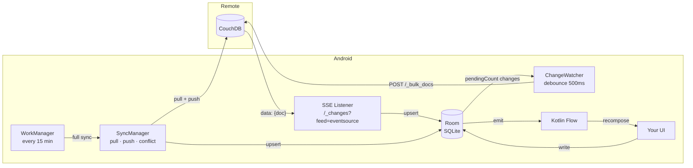
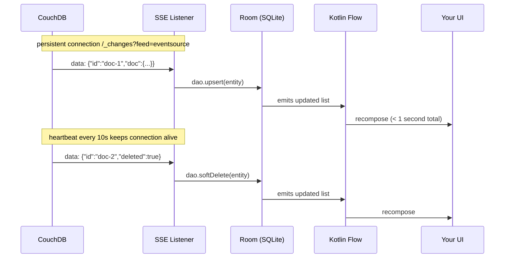
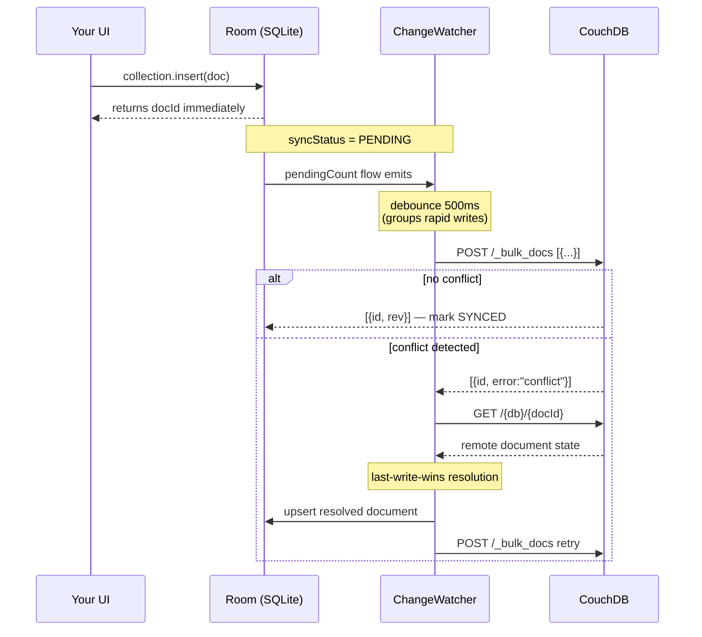
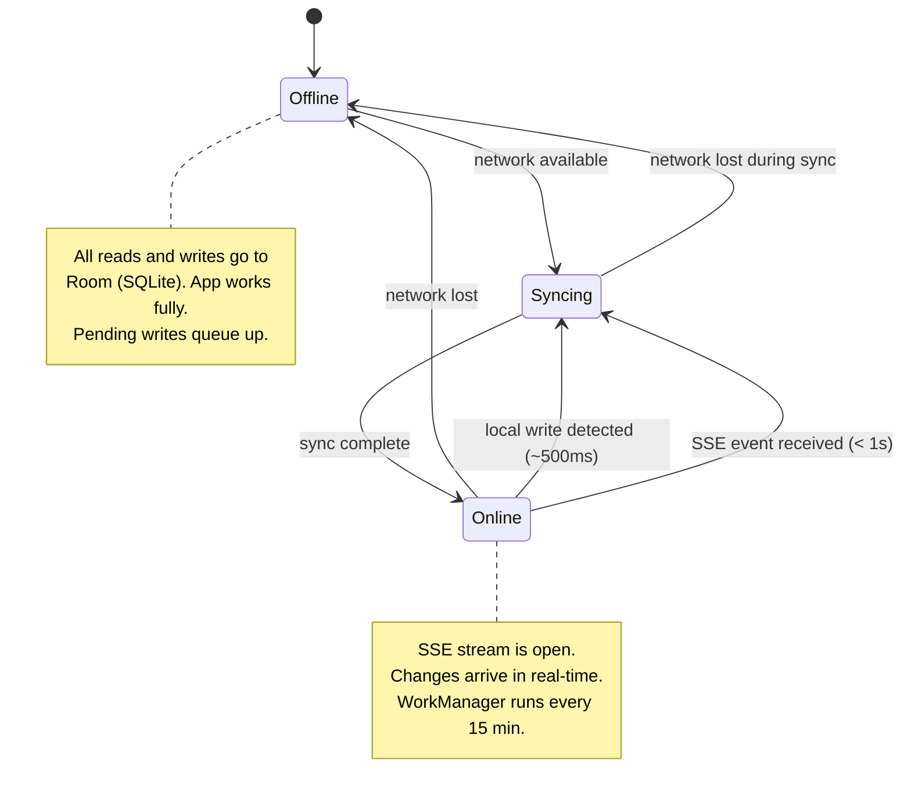
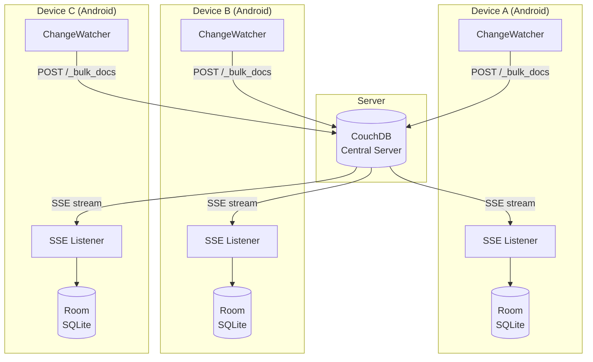
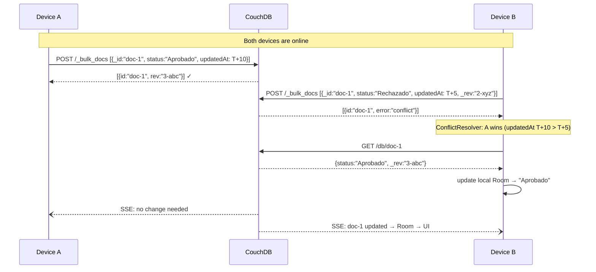
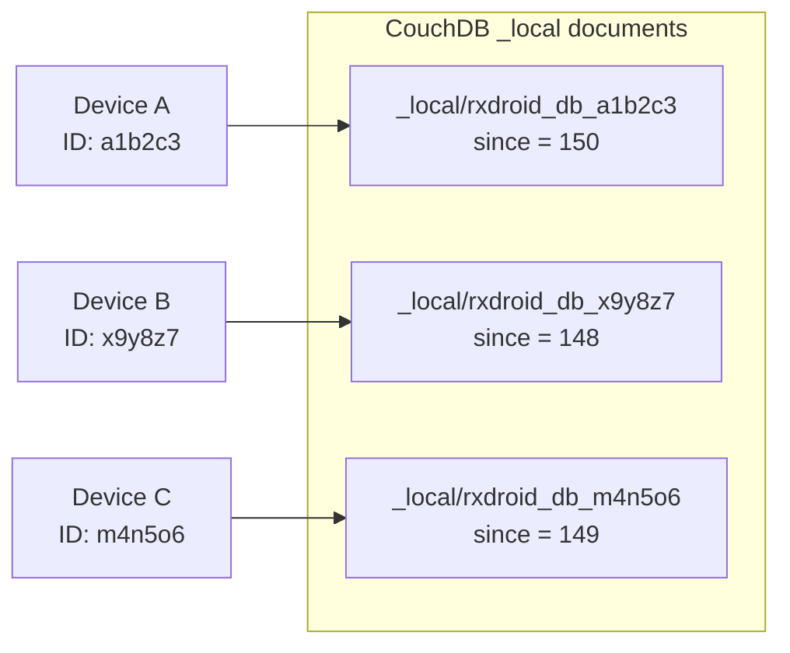

# PouchDroid

Offline-first CouchDB sync library for Android. Write to local SQLite, sync to CouchDB automatically when the network is available.

Inspired by [PouchDB](https://pouchdb.com) and [RxDB](https://rxdb.info). Built with Kotlin, Room, and Kotlin Flow.

---

## Features

- **Offline-first** — all reads and writes go to local SQLite (Room). The app works with no network.
- **Real-time sync** — CouchDB changes arrive via Server-Sent Events in under 1 second.
- **Reactive queries** — collections return `Flow<List<T>>` that update automatically on any local or remote change.
- **Dynamic JSON** — no data class required. Works with any document structure using `RxDocument`.
- **Typed mode** — optional data class support for collections with a fixed schema.
- **Background sync** — WorkManager handles periodic sync and retries when the app is not in the foreground.
- **Conflict resolution** — last-write-wins by default.

---

## Installation

### 1. Add JitPack to your repositories

In `settings.gradle.kts`:

```kotlin
dependencyResolutionManagement {
    repositoriesMode.set(RepositoriesMode.FAIL_ON_PROJECT_REPOS)
    repositories {
        google()
        mavenCentral()
        maven { url = uri("https://jitpack.io") }
    }
}
```

### 2. Add the dependency

In `app/build.gradle.kts`:

```kotlin
dependencies {
    implementation("com.github.gjagomez.PouchDroid:rxdroid-sync:1.0.0")
}
```

> No additional setup needed. Room, OkHttp, WorkManager, and Kotlin Flow come as transitive dependencies.

---

## Quick Start

```kotlin
// 1. Create the database (once, in Application or Activity)
val db = RxDroid.create(
    context = this,
    config = RxDroidConfig(
        url      = "https://your-server.com:6984/",
        username = "admin",
        password = "password",
        database = "my_database"
    )
)

// 2. Open a collection (dynamic — no data class needed)
val formularios = db.collection("formularios")

// 3. Observe changes as a Flow
formularios.findAll().collect { list ->
    // Called every time local or remote data changes
}

// 4. Insert a document
formularios.insert(RxDocument(mapOf(
    "_id"    to "doc-1",
    "name"   to "My Document",
    "status" to "pending"
)))

// 5. Start sync (SSE + WorkManager)
db.startSync()
```

---

## RxDocument — Dynamic JSON

Use `RxDocument` when documents have variable fields (e.g. forms with different `formId`).

```kotlin
val col = db.collection("formularios")

col.findAll().collect { list ->
    list.forEach { doc ->
        // Top-level fields
        val id       = doc.id                          // _id
        val promotor = doc.getString("promotor")       // "1289"
        val formId   = doc.getInt("formId")            // 262
        val status   = doc.getString("status")         // "Enviado"

        // Nested object
        val data = doc.getNested("data")
        val statusLocal = data?.getString("status_local")

        // Double-encoded JSON string (field that contains a JSON string)
        val interna = data?.getDataAsDocument("data")
        val nombre  = interna?.getString("PRIMER_NOMBRE")   // "WENDY"
        val monto   = interna?.getDouble("MONTO_SOLICITADO") // 9000.0
    }
}
```

### RxDocument API

| Method | Returns | Description |
|---|---|---|
| `doc.id` | `String` | Value of `_id` field |
| `doc.rev` | `String?` | Value of `_rev` field |
| `doc.getString(key)` | `String?` | Field as String |
| `doc.getInt(key)` | `Int?` | Field as Int |
| `doc.getDouble(key)` | `Double?` | Field as Double |
| `doc.getBoolean(key)` | `Boolean?` | Field as Boolean |
| `doc.getList(key)` | `List<Any?>?` | Field as List |
| `doc.getNested(key)` | `RxDocument?` | Nested object as RxDocument |
| `doc.getDataAsDocument(key)` | `RxDocument?` | Double-encoded JSON string parsed as RxDocument |
| `doc.has(key)` | `Boolean` | Whether the field exists |
| `doc.toMap()` | `Map<String, Any?>` | Raw map |
| `doc.toJson()` | `String` | JSON string |

---

## Typed Collections

For collections with a fixed schema, use a data class:

```kotlin
data class Producto(
    val id: String = "",
    val nombre: String = "",
    val precio: Double = 0.0
)

val productos = db.collection("productos", Producto::class.java)

productos.findAll().collect { list: List<Producto> ->
    // fully typed
}

productos.insert(Producto(id = "1", nombre = "Café", precio = 9.99))
```

---

## Collection API

```kotlin
val col = db.collection("name")          // dynamic
val col = db.collection("name", T::class.java)  // typed

col.findAll(): Flow<List<T>>             // observe all documents
col.findById(id): Flow<T?>               // observe one document
col.getAll(): List<T>                    // one-shot read
col.getById(id): T?                      // one-shot read by id
col.insert(doc): String                  // returns the document id
col.update(id, doc)                      // update existing document
col.delete(id)                           // soft delete (synced as _deleted)
```

---

## Configuration

```kotlin
RxDroidConfig(
    url                  = "https://your-server.com:6984/",
    username             = "admin",
    password             = "your_password",
    database             = "my_database",
    liveSync             = true,    // enable SSE real-time pull (default: true)
    syncIntervalMinutes  = 15L,     // WorkManager background interval (default: 15)
    batchSize            = 50       // documents per sync page (default: 50)
)
```

---

## Sync Control

```kotlin
db.startSync()        // start SSE + WorkManager + local change watcher
db.stopSync()         // stop all sync
db.syncNow()          // trigger immediate one-time sync
db.pauseLiveSync()    // pause SSE (call in onPause)
db.resumeLiveSync()   // resume SSE (call in onResume)
db.syncAll()          // suspend: sync all collections now
```

**Recommended lifecycle usage:**

```kotlin
override fun onResume() {
    super.onResume()
    db.resumeLiveSync()
}

override fun onPause() {
    super.onPause()
    db.pauseLiveSync()
}
```

---

## How Sync Works

### Architecture



---

### Pull — CouchDB to Android (real-time)



---

### Push — Android to CouchDB (~500ms)



---

### Offline / Online state



---

| Direction | Mechanism | Latency |
|---|---|---|
| CouchDB → Android | SSE `/_changes?feed=eventsource` | < 1 second |
| Android → CouchDB | ChangeWatcher + debounce | ~500ms |
| Network reconnect | ConnectivityManager callback | ~1 second |
| App returns to foreground | `resumeLiveSync()` + `syncNow()` | immediate |
| Background (app closed) | WorkManager periodic | 15 minutes |
| Retry after error | WorkManager exponential backoff | 5s → 10s → 20s |

---

## Multi-Device Sync

PouchDroid uses CouchDB as the central hub. Every device syncs independently with the same CouchDB server. When Device A writes a document, CouchDB notifies all other connected devices via their SSE streams within 1 second.

### Architecture



### What happens when two devices edit the same document



### Checkpoint isolation per device

Each device generates a unique ID on first install. This ID is included in the CouchDB checkpoint key so devices never overwrite each other's sync position.



### Behavior summary

| Scenario | Result |
|---|---|
| Device A writes, Device B online | Device B receives change via SSE in < 1 second |
| Device A writes, Device B offline | Device B downloads the change on next sync |
| Both devices write the same doc simultaneously | Conflict detected, last-write-wins (by `updatedAt`) |
| Device added to the fleet | Full sync from CouchDB on first start |
| Device offline for days | Catches up from its own checkpoint on reconnect |

---

## Requirements

- Android API 24+
- Kotlin 2.0+
- AGP 8.0+

---

## License

MIT License. See [LICENSE](LICENSE).
